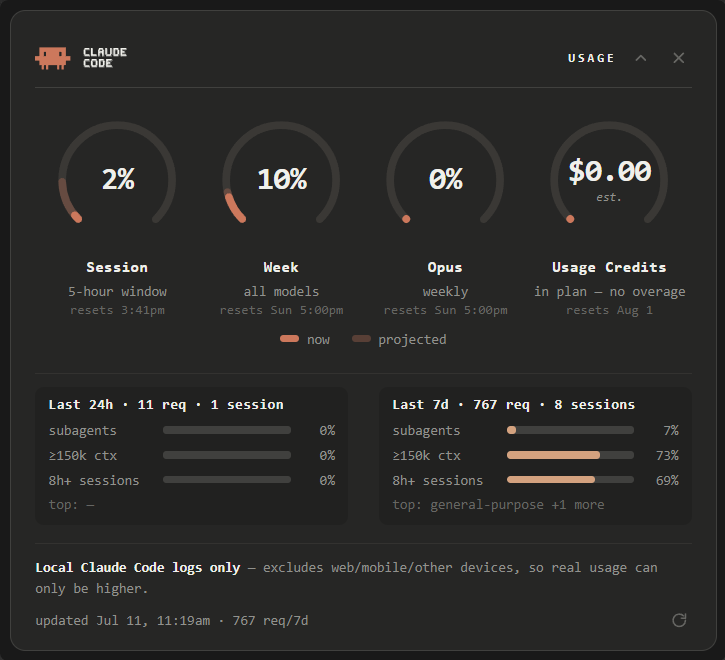
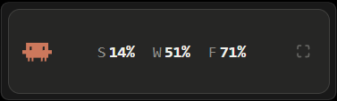

# Claude Usage Widget

An always-on-top desktop gauge for **Claude Code** usage — Session · Week ·
weekly Opus share, plus a **Usage Credits estimator** (what you're plausibly
being billed *past* your plan, at real API rates, against your monthly cap)
and a compact strip of local behavior insights (requests, sessions, subagent /
big-context / long-session shares). All of it estimated entirely from the
transcript logs already on your machine. Glance at a widget instead of typing
`/usage`.

> **Unofficial.** Not affiliated with or endorsed by Anthropic.

Collapsed to the pill (header chevron), it sits in the corner of your eye:

## Why it's safe (and why it's an estimate)

- It reads **only** your own local Claude Code transcripts
  (`~/.claude/projects/**/*.jsonl`).
- It makes **zero network calls** and never touches claude.ai. Anthropic's
  Consumer Terms forbid automated access to the product except via the API, and
  the authoritative `/usage` numbers aren't exposed to API keys — which is
  exactly why this tool is a local **estimate**, not a readout.
- Because it can only see this machine, every number is a **floor**: usage from
  claude.ai web, mobile, and other machines is invisible here. Real usage can
  only be higher than what the widget shows.

## Install (30 seconds)

1. Python 3.9+ ([python.org](https://www.python.org/downloads/) installer; keep
   the "py launcher" option checked).
2. `py -m pip install -r requirements.txt`
3. Double-click **`run.vbs`**. That's it — the widget finds your logs by itself.

Start at login: `Win+R` → `shell:startup` → drop a shortcut to `run.vbs` there.
(Delete the shortcut to undo; no registry edits.)
Uninstall: delete this folder (`py -m pip uninstall pywebview` if you also want
the library gone).

## First run

It works immediately, with two honest hedges until you calibrate:

- the gauges wear an `est.` badge — the cost→% scale is a plan-tier default, so
  set `plan = max20x | max5x | pro` in `config.txt` to match your subscription;
- the weekly gauges measure the trailing 7 days and show `resets unknown` until
  your first paste pins your account's real weekly reset time.

## Make it accurate — the one-paste loop

1. Run `/usage` in Claude Code and copy the whole output.
2. Paste it at the bottom of **`config.txt`** (the widget creates the file on
   first run) and save.
3. Done. The running widget picks it up within ~15 seconds. The file's save
   time anchors the reading; readings are ingested exactly once, so you can
   overwrite the old paste or leave it there — whatever's tidier for you.

Each paste tightens the fit and re-pins your session/weekly reset times. The
`est.` badge clears once three varied readings are in. After that, paste again
only when you feel like truing it up — the widget never nags. One safety net:
a reading that contradicts your own logs (it happens — Anthropic occasionally
resets or rebases the counters mid-window during limit migrations) is skipped
automatically, with a note in the footer.

## How the estimate works (one paragraph)

The engine dedups your transcripts to true billable requests (one per
`requestId` — verified to reproduce `/usage`'s own request count within ~1%),
collapses each request's token mix (input, output, cache reads/writes) into one
cost-equivalent dollar number using per-model pricing, sums that over the live
session/week windows, and scales cost→% with a per-gauge factor fitted through
the origin from your pasted `/usage` readings. Reset times come from the pastes
too: the 5-hour session grid re-anchors intelligently across idle gaps, and all
window math is UTC-absolute (DST-safe).

## The Usage Credits gauge

Usage credits are what you pay **past** your plan's included allowance, at
standard API rates — in-plan usage costs $0 at the margin and reads as $0 here,
on every tier. The dial estimates two billing routes for the current credits
month: **excluded-model billing** (once Fable leaves your plan — set
`credits_from` to that date; blank means it's still included and bills $0) and
**in-plan overage** (usage past your calibrated weekly budget, re-priced at API
rates — computed day-by-day, marked `~`, and deliberately under-claiming: it
never invents a boundary from uncalibrated defaults and doesn't model
session-cap crossings). The subtitle breaks the total out per model, `est.`
where estimated. `credits_cap` fills the dial and drives the projection;
`credits_reset_day` defaults to the 1st. Always badged `est.` — real billing
isn't visible locally; this is a floor-side estimate, never a bill. Past days
freeze into a small internal ledger, so the month survives Claude Code's
~30-day transcript cleanup.

## The insights strip

Under the gauges: requests and sessions for the last 24h/7d, with cost-share
mini-bars for subagent work, big-context work (≥150k), and long sessions
(8h+), plus your top subagent types. Counts line up with `/usage`'s own panel;
the share definitions are deliberately the widget's own — *direct cost shares*
(what fraction of your spend-equivalent was literally subagent requests),
which is sharper than `/usage`'s session-bucket attribution ("came from
subagent-heavy sessions"), so expect those two numbers to differ.

## Reading the gauges

- solid arc = now · faint arc = straight-line projection to the reset (appears
  once ≥8% of the window has elapsed) · red = projected ≥90% or over 100 now
- `est.` = provisional (few calibration points, or an under-corroborated window)
- `~` before a session reset = the 5h window's phase is uncertain (it may have
  started off-device, or followed a long idle gap)
- collapse to a slim pill via the header chevron · global show/hide:
  `Ctrl+Alt+U` · close: `✕` · drag anywhere on the header/pill

## Troubleshooting

| symptom | fix |
|---|---|
| "couldn't find your Claude Code logs" | set `logs_path` in `config.txt` — only needed for nonstandard installs; `$CLAUDE_CONFIG_DIR` is honored too |
| all zeros, `0 req/7d` | logs found but empty — run something in Claude Code first |
| nothing appears on double-click | run `py app.py` in a terminal to see the error — usually a missing `py` launcher (Microsoft Store Python): use `pythonw app.py`, or install the WebView2 runtime (preinstalled on Windows 11) |
| numbers look low | that's the floor: claude.ai / mobile / other-machine usage is invisible to local logs |
| Fable gauge seems to track Opus too | flip `FABLE_HYP` in `engine.py` (`"A"` = Fable-only, `"B"` = Opus-class) |

## Privacy

Everything stays on your machine. Your personal files — `config.txt` (logs path
+ pasted readings), `points.json` (derived calibration points), `state.json`
(window state) — are gitignored, so a fork or PR can never accidentally ship
your paths or usage.

## Files

| file | role |
|---|---|
| `app.py` | pywebview host: window, icon, hotkey, collapse, auto-refresh |
| `engine.py` | data layer: find logs → dedup → cost/window math → live fit |
| `index.html` | the UI (SVG clay gauges) |
| `run.vbs` | silent launcher |
| `config.txt` | **yours** — auto-created; optional overrides + `/usage` pastes |
| `config.example.txt` | what the config looks like |
| `points.json` / `state.json` | internal state, auto-managed (gitignored) |

MIT license.
